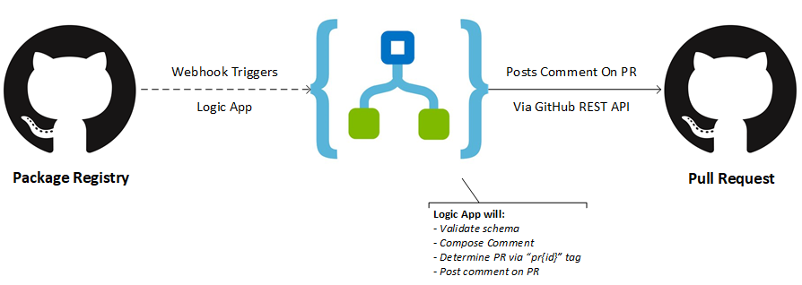

# GitHub Package Registry Bot for GitHub Pull Requests

A bot to post comments on GitHub pull requests when a new NuGet package is pushed to GitHub Package Registry.

# Prerequisites
- An Azure subscription
- Access to a GitHub Package Registry account
- GitHub user that will be used to post comments
- Push NuGet versions in format of `PR-{pr-id}`, but you can also tweak the template to use your pattern

## How it works
The bot is a simple Azure Logic App which will receive webhook notifications from GitHub Package Registry when new packages are pushed to your feed.

It will interpret the passed information to compose a comment on the PR that triggered the new packages.

By default the Logic App will determine the PR ID given it assumes to have the `PR-{pr-id}` format.

If your pattern diverts from this pattern you can always tweak the bot and deploy that instead.